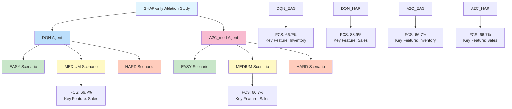

# FCS Analysis Summary

## Summary Table

| Agent | Scenario | Avg FCS | Most Important Feature |
|-------|----------|---------|------------------------|
| DQN | EASY | 66.7% | Inventory |
| DQN | MEDIUM | 66.7% | Sales |
| DQN | HARD | 88.9% | Sales |
| A2C_mod | EASY | 66.7% | Inventory |
| A2C_mod | MEDIUM | 66.7% | Sales |
| A2C_mod | HARD | 66.7% | Sales |
