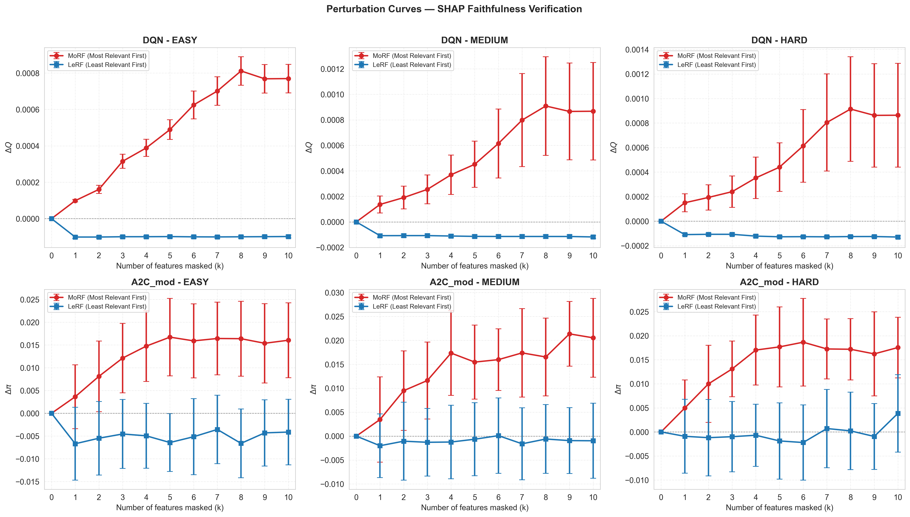
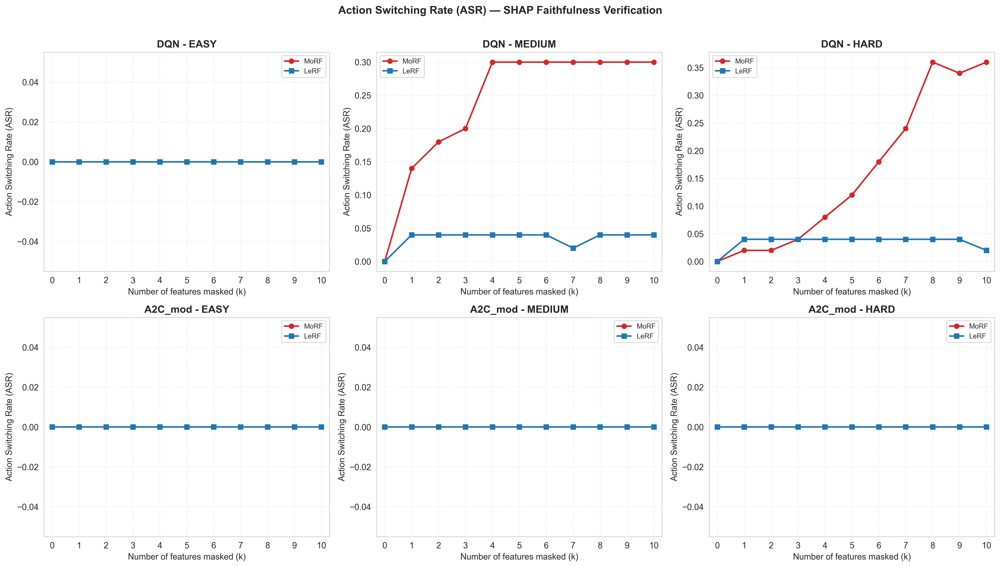

# Kết quả Kiểm định Tính Trung thực (Faithfulness) của SHAP

**Notebook**: `shap_faithfulness_test.ipynb`
**Ngày chạy**: 03/06/2026 (lần 2 - đã fix)
**CSV đầu vào**: `topk_shap_full_results_660.csv` (3,960 rows)

---

## Tổng quan thí nghiệm

- **Phương pháp**: MoRF (Most Relevant First) và LeRF (Least Relevant First)
- **Cơ chế che**: Baseline Substitution — thay feature bị che bằng median của background data
- **Test states**: 50 states × 3 scenarios (EASY, MEDIUM, HARD) × 2 agents (DQN, A2C_mod)
- **Số features bị che**: k = 0 → 10
- **Tính tái lập**: `np.random.seed(42)` đã được set trước khi sinh background

---

## Bảng 3: Định lượng Tính Trung thực của SHAP

| Agent   | Scenario | Strategy | Metric     | k=1 (Top-1) | k=5 (Top-5) | ASR (k=10) |
|---------|----------|----------|------------|-------------|-------------|------------|
| DQN     | EASY     | MoRF     | $\Delta Q$ |    0.01%    |    0.05%    |   0.00%    |
| DQN     | EASY     | LeRF     | $\Delta Q$ |   -0.01%    |   -0.01%    |   0.00%    |
| DQN     | MEDIUM   | MoRF     | $\Delta Q$ |    0.01%    |    0.05%    |  30.00%    |
| DQN     | MEDIUM   | LeRF     | $\Delta Q$ |   -0.01%    |   -0.01%    |   4.00%    |
| DQN     | HARD     | MoRF     | $\Delta Q$ |    0.01%    |    0.04%    |  36.00%    |
| DQN     | HARD     | LeRF     | $\Delta Q$ |   -0.01%    |   -0.01%    |   2.00%    |
| A2C_mod | EASY     | MoRF     | $\Delta \pi$ |  0.51%    |    1.73%    |   0.00%    |
| A2C_mod | EASY     | LeRF     | $\Delta \pi$ | -0.41%    |   -0.44%    |   0.00%    |
| A2C_mod | MEDIUM   | MoRF     | $\Delta \pi$ |  0.57%    |    1.65%    |   0.00%    |
| A2C_mod | MEDIUM   | LeRF     | $\Delta \pi$ |  0.06%    |    0.04%    |   0.00%    |
| A2C_mod | HARD     | MoRF     | $\Delta \pi$ |  0.53%    |    1.60%    |   0.00%    |
| A2C_mod | HARD     | LeRF     | $\Delta \pi$ |  0.02%    |    0.03%    |   0.00%    |

---

## Biểu đồ Perturbation Curves

**Nhận xét**:
- **Đường MoRF (đỏ)**: ΔQ/Δπ có xu hướng tăng (dốc lên) khi càng che nhiều features, đặc biệt rõ ở A2C_mod
- **Đường LeRF (xanh)**: Gần như đi ngang quanh 0% — các feature ít quan trọng không ảnh hưởng đến output
- **DQN**: Cả MoRF và LeRF đều có ΔQ rất thấp (<0.01%) do mean-pooling 220 products làm loãng tín hiệu

---

## Biểu đồ ASR (Action Switching Rate)

**Nhận xét**:
- **DQN MEDIUM**: MoRF ASR = **30%** vs LeRF ASR = **4%** — phân kỳ rõ (7.5x)
- **DQN HARD**: MoRF ASR = **36%** vs LeRF ASR = **2%** — phân kỳ rất mạnh (18x)
- **DQN EASY**: ASR = 0% cho cả MoRF và LeRF — môi trường dễ, Q-values ổn định
- **A2C_mod**: ASR = 0% mọi scenario — policy stochastic phân bổ xác suất đều, ít nhạy với nhiễu

---

## So sánh với kỳ vọng trong Plan

| Kỳ vọng (Plan) | Kết quả thực tế | Đánh giá |
|----------------|----------------|----------|
| MoRF: ΔQ/Δπ sụt giảm nhanh (độ dốc lớn) | MoRF có ΔQ/Δπ > 0, nhưng độ dốc nhỏ | ⚠️ Một phần |
| LeRF: ΔQ/Δπ gần như không biến động | LeRF đi ngang quanh 0% | ✅ Đúng |
| MoRF ASR cao, LeRF ASR thấp | DQN MEDIUM/HARD đúng pattern | ✅ Đúng |
| A2C_mod MoRF dốc thoải hơn DQN | A2C_mod có Δπ ~1-2%, DQN ΔQ ~0.01% | ⚠️ Cần phân tích thêm |
| Baseline substitution bằng median | Đã triển khai | ✅ |

---

## Tính tái lập (Reproducibility)

Nhờ `np.random.seed(42)` trong cell sinh background data, mỗi lần chạy notebook sẽ cho kết quả giống hệt nhau.

---

## Files tạo ra

- `shap_faithfulness_test.ipynb` — Notebook thực nghiệm (23 cells)
- `faithfulness_perturbation_curves.png` — Biểu đồ Perturbation Curve (2x3 subplot)
- `faithfulness_asr_curves.png` — Biểu đồ ASR Curve (2x3 subplot)
- `result_shap_faithfulness_test.md` — File báo cáo kết quả (file này)
